# 学习笔记--1.4 数据标注

# **SSS [**课程链接**](https://www.bilibili.com/video/BV1HL41147aL/?spm_id_from=333.788&vd_source=f20f12f3aeb414c35504dd8ea1cba544)**

## 1. 数据标注思维导图
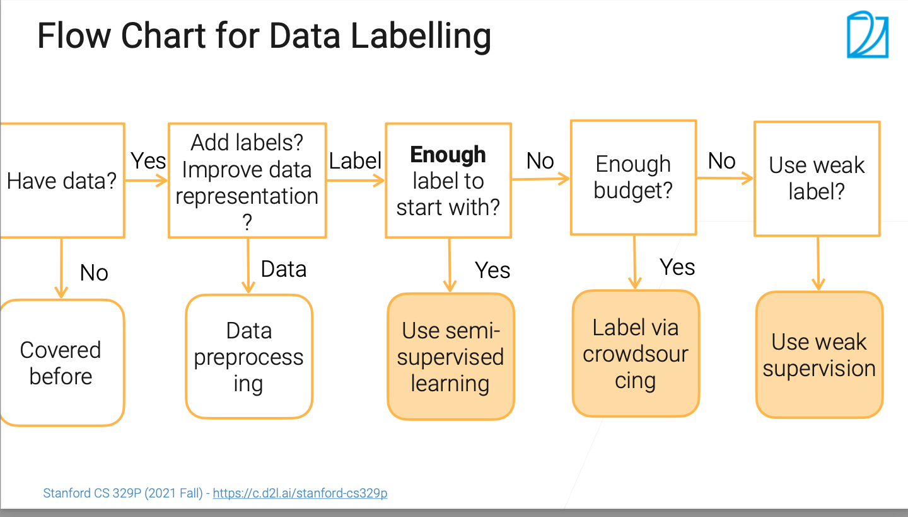

* 是否有足够多的数据
* **提升标注**/提升数据质量/提升模型（本章节重点关注**标注**）
* 标注足够--半监督学习 Semi-Supervised Learning (SSL)
* 标注不够，Money足够--众包的方式花钱找人标注
* 啥都没有--弱监督学习 weak supervision

补充

```
深度学习：X监督学习主要靠有无标注/标注的多少来判断(https://www.cnblogs.com/AirCL/p/17078063.html)
* 半监督：同时用有标签和无标签的数据进行训练。通常是两阶段的训练，先用（较小规模的）有标签数据训练一个Teacher模型，再用这个模型对（较大规模的）无标签数据预测伪标签，作为Student模型的训练数据；目前已经有很多直接end-to-end地训练，能够大大减少半监督训练的工作;
* 自监督：在无标注数据上训练，通过一些方法让模型学习到数据的inner representation，再接下游任务，例如加一个MLP作为分类器等。但接了下游任务之后还是需要在特定的有标签数据上finetune，只是有时候可以选择把前面的层完全固定，只finetune后面接的网络的参数;
* 弱监督：用包含噪声的有标签数据训练。
```


## 2. 半监督学习 Semi-Supervised Learning (SSL)
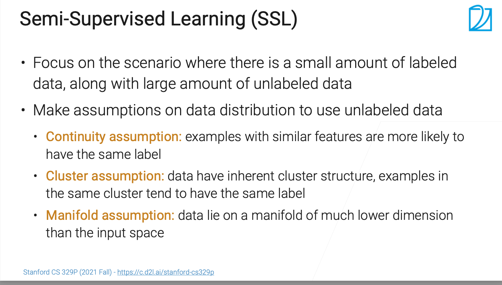

* **解决的问题**：有小部分数据有标注，大部分数据没有标注
* 半监督学习对数据分布的假设
	* 连续性假设：如果两个样本拥有相同特征，更倾向于属于同一标签
	* 类的聚类假设：如果数据有聚类结构，非空间随机分布，同一个聚类里面的样本更倾向于属于同一标签
	* 流行假设：虽然我们收集的数据可能看似维度比较高，但是数据有可能是在低维的流型上分布的（可通过降维得到干净点的数据）


### 2.1 自训练（半监督学习中的算法之一） Self-training
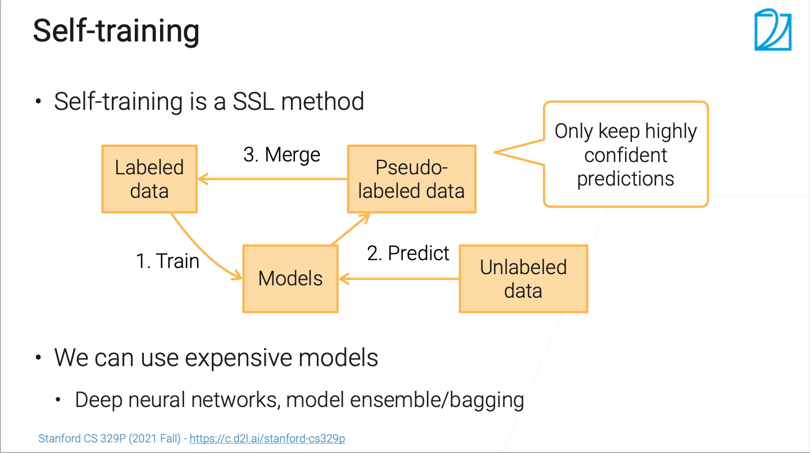

自学习流程

* Step1 拥有标注的数据训练模型
* Step2 用训练出来的模型预测非标注的数据产生标注
* Step3 将机器标注的数据和有标注的数据合并后重新走Step1 Step2（流程循环）

**关键点**

* Step2 产生的标注是模型输出的（非人），很有可能是有噪音的，这里我们应该有选择的做筛选，筛选保留置信的数据去合并去训练，这样模型的置信度会越来越高
* 我们这个模型只是用来训练标注的不会部署到线上，所以可以考虑用一些比较贵比较好的模型


## 3. 通过众包标注 
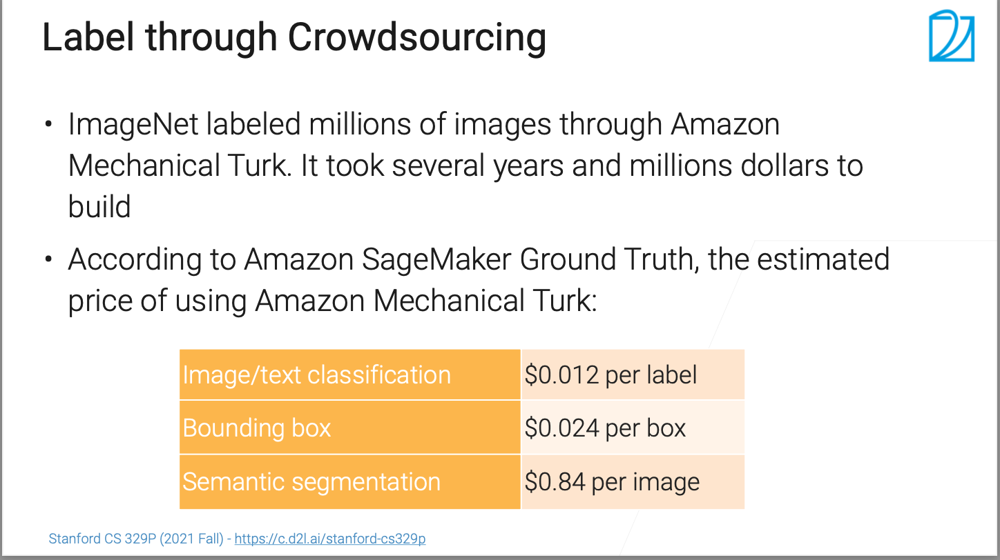

比如：ImageNet 通过Amazon Mechanical Turk服务（找人）标注了上百万的图片

根据 Amazon SageMaker Ground Truth 服务，预测Amazon Mechanical Turk服务的价格：标注一张图片/文本的的价格是1.2美分；图上圈一个框（标注物）的成本是2.4美分；更复杂标记一次 84美分


### 3.1 众包方式的挑战
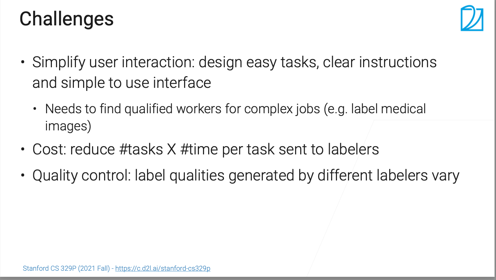

* 简化用户交互：包括设计简单任务流程，清晰说明，简单使用交互界面
	* 众包群体很多人能力不一，学历不一，如果任务特别复杂，说明不清晰，交互界面复杂，可能得找质量更高的人帮忙标注，时间和价格成本都会增加
* 成本： 任务数 * 完成一个任务所需的时间 * 标注工时间价格 = 总成本
* 质量控制：上面有介绍众包群体很多人能力不一，标注的质量效果也不一样，需要做质量控制
	* 比如：自己控制or找标注公司做质量控制


#### 3.1.1 用户交互
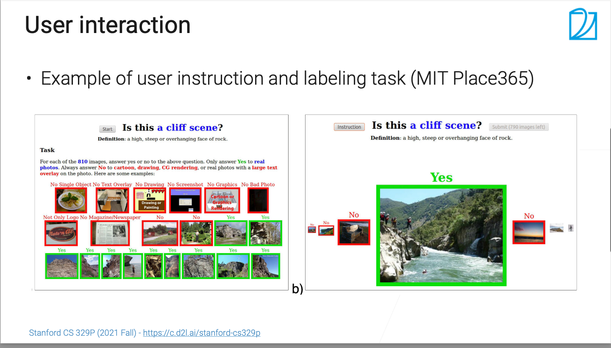


#### 3.1.2 减少任务数：主动学习（Active Learning）
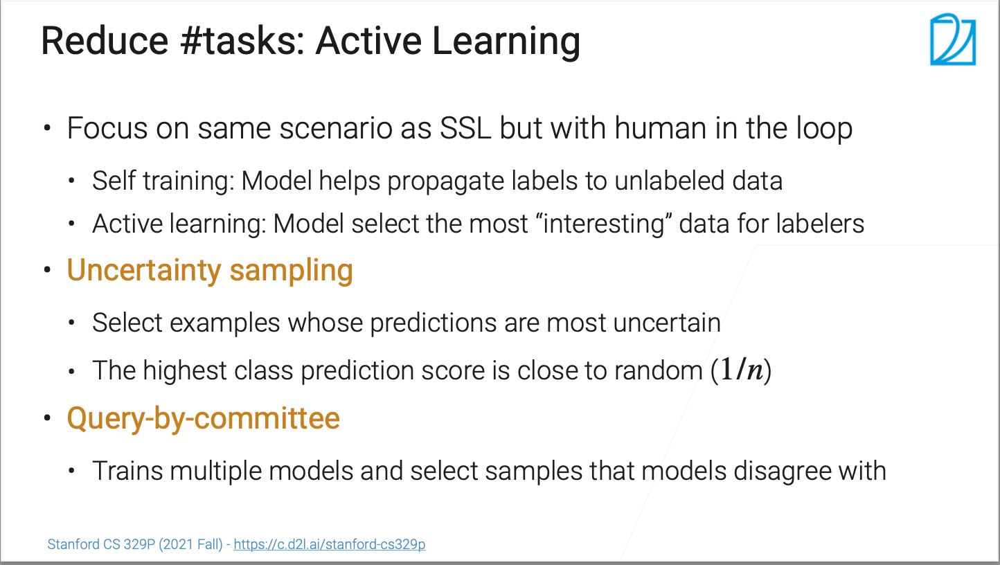
很多时候采集的图片比较简单，可能在采集的时候就是有一定置信度的，这种可以通过主动学习来降低成本。

* 主动学习（Active Learning）和半监督学习（SSL）比较类似，相较于SSL加入了人的参与，选出“最有趣”（“最有趣”==最不值置信）的未标注的数据让标注工负责标注，有两种方式
	* 不确定性采样：选择概率最不确定的样本，该样本属于每个标注的概率接近平均值如：1/n，n代表总标注类数量
	* 和SSL一样使用更贵的模型


#### 3.1.3 主动学习 + 自训练
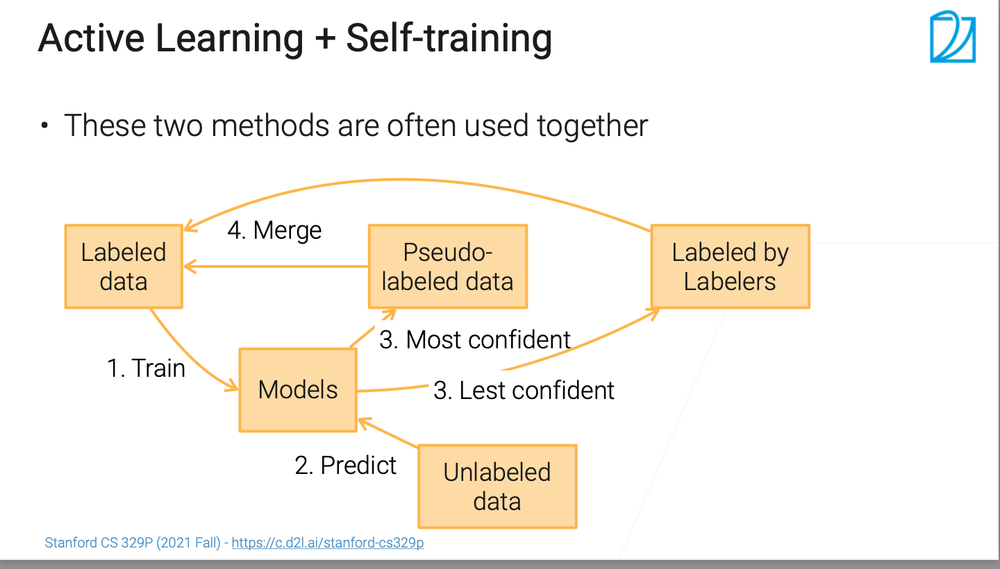
这两个方法经常结合一起用

操作流程如下：

* Step1 用有标注的数据训练模型
* Step2 用模型预测未标注的数据
* Step3.1 置信的样本数据和有标注的数据和斌
* Step3.2 选择置信度低的样本进行人工标注，将标注后的数据和之前已标注的数据合并
* Step4 合并后的数据重新走 Step 1 2 3 

### 3.1.4 质量控制
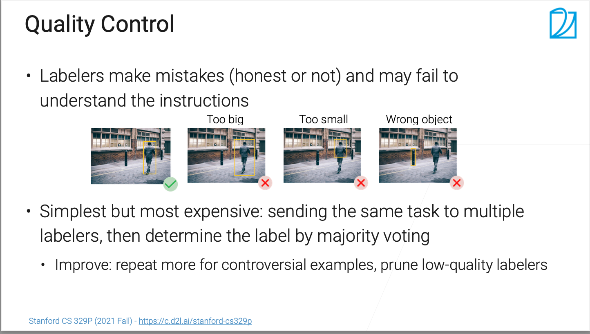

* 标注工（非专家）可能犯错（诚信问题/能力问题），也可能没有理解说明，见上面例子：框太大把非要求的内容标注，框太小内容没有标注完整，直接标错
* 最简单且最贵的解决方法：同一个任务发送给多个标注工，投票决定结果
	* 检查标注工能力诚信，可以先试，不好的后面不合作
	* 把比较置信的样本先给标注工标注，确认水平

## 4. 弱监督学习（没标注+没钱）
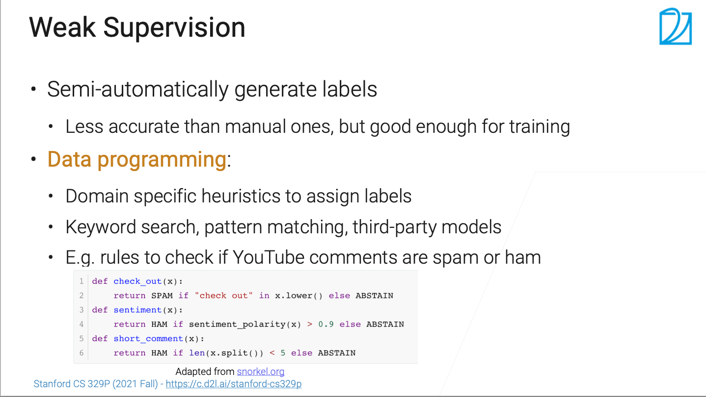

* 半自动生成标号：效果比人工标注差，但是足够用来训练
* 数据编程：用于分配标签的启发式程序
	* 自己写规则逻辑（不全） 

## 总结
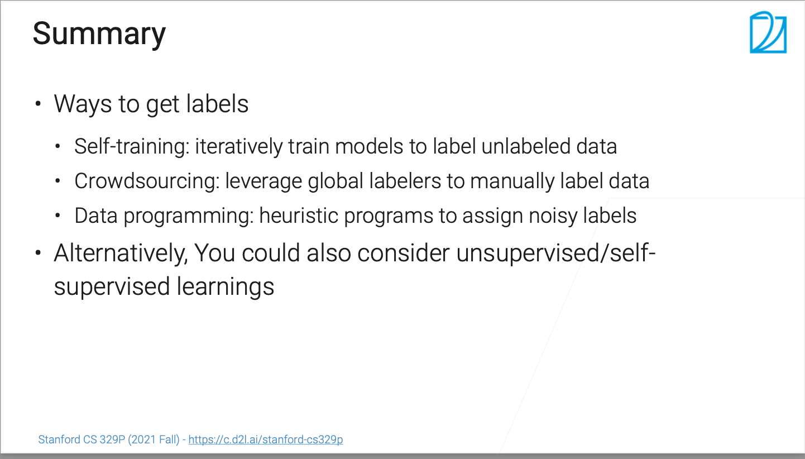

获取标注的路径

* SSL重的自训练：迭代训练模型，为未标记数据分配标签
* 众包：利用全球标注员手动标注数据
* 数据编程：开发用于分配噪声标签的启发式程序