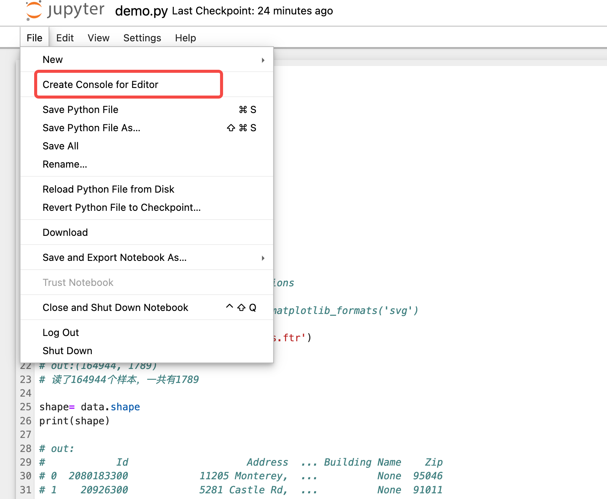
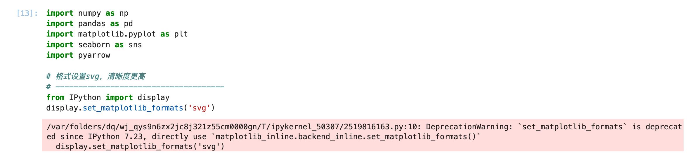
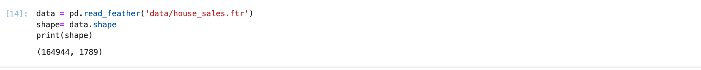
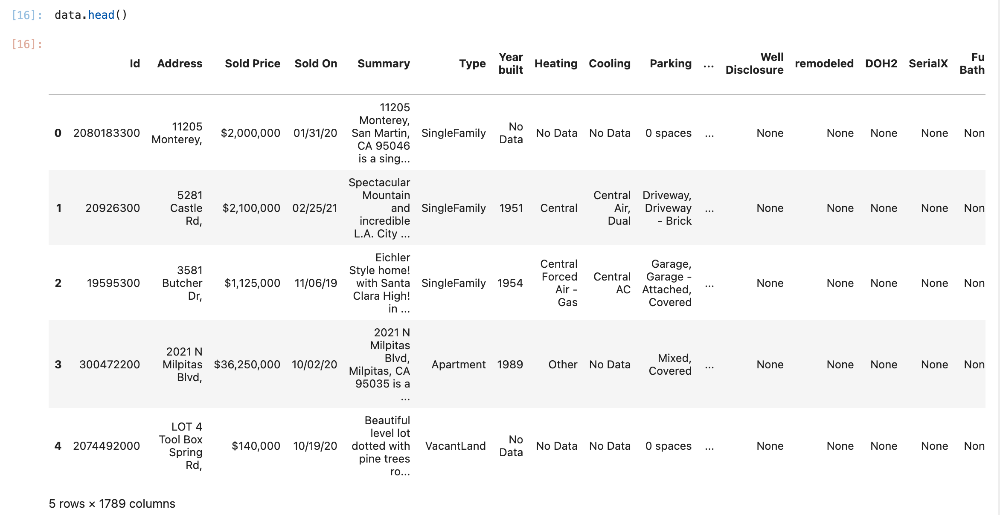
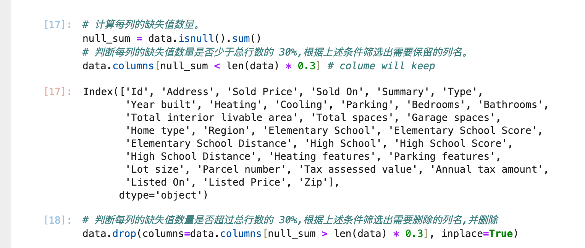
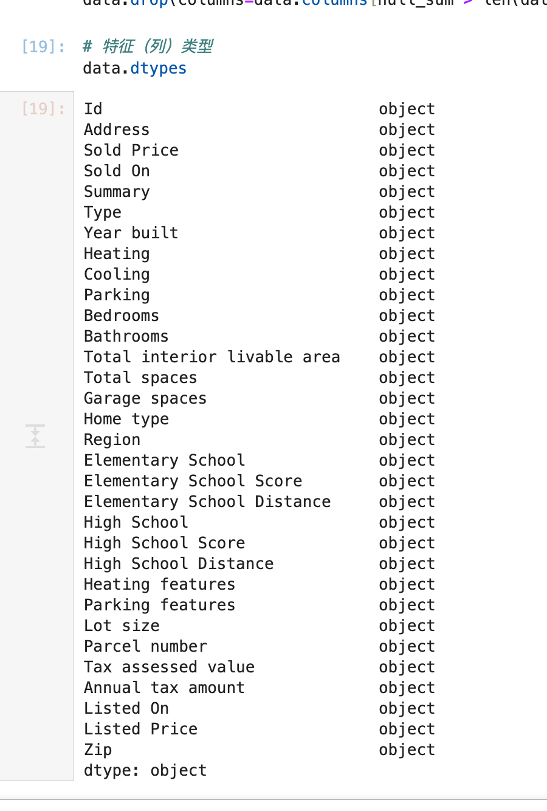

# 学习笔记--2.1 探索性数据分析

[课程地址](https://www.bilibili.com/video/BV1Xh411p7M9/?spm_id_from=333.788&vd_source=f20f12f3aeb414c35504dd8ea1cba544)

## 1.Jupyter 使用实记（Mac环境）

### 步骤1 安装Jupyter
```
pip install jupyter
```
### 步骤2 进入Jupyter代码运行环境


## 2.数据分析课程实录
### 配置demo所需环境
注意：Jupyter在进入运行环境后，运行代码的快捷键为 Shift+Enter，[学习资料](https://wenku.csdn.net/answer/gfriouz3i4)

```
pip install numpy pandas matplotlib seaborn pyarrow

# 数据处理+可视化工具包
# numpy: python里面做数据分析最常见的包
# pandas: 处理表的工具包
# matplotlib.pyplot/seaborn: 画图工具
```

### Demo代码环境 导包初始化


### 读数据集文件


表示读了164944个样本，一共有1789列（特征）

### 输出特征类型（列）


可以发现上面有很多None的脏数据，需要处理

### drop 数据缺失占比>30%的列（过滤脏数据）

可以判断列的null占比>30%的数据为脏数据，drop调

### 输出列的数据类型（判断类型是否准确）


