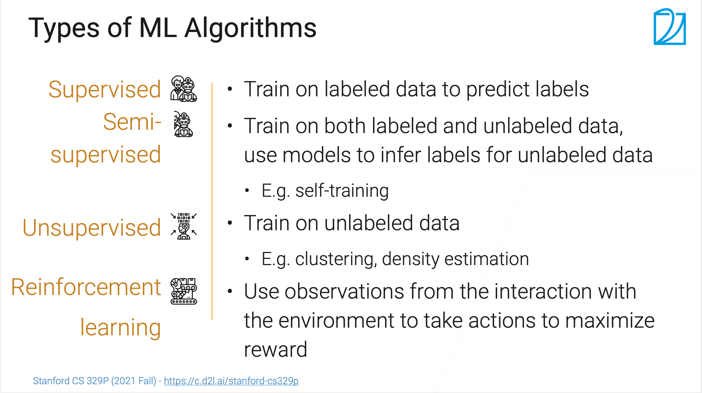
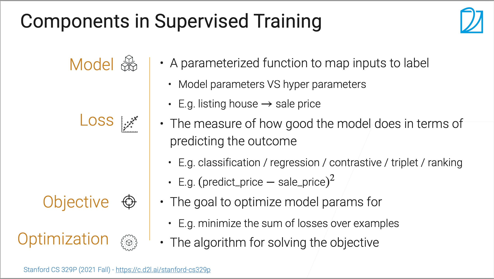
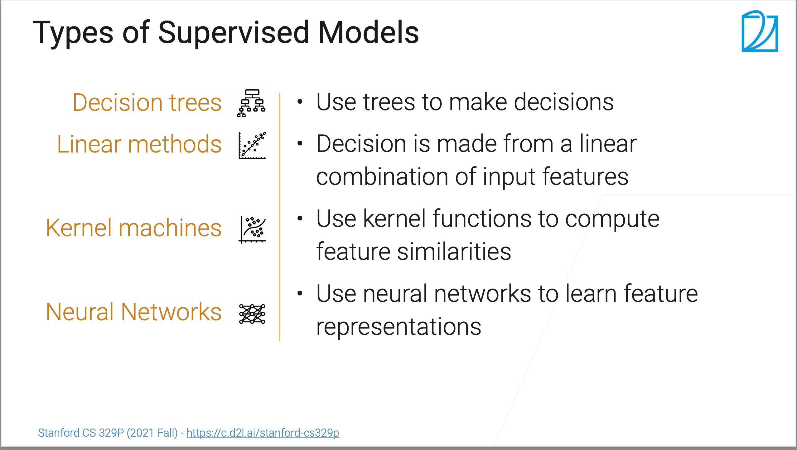
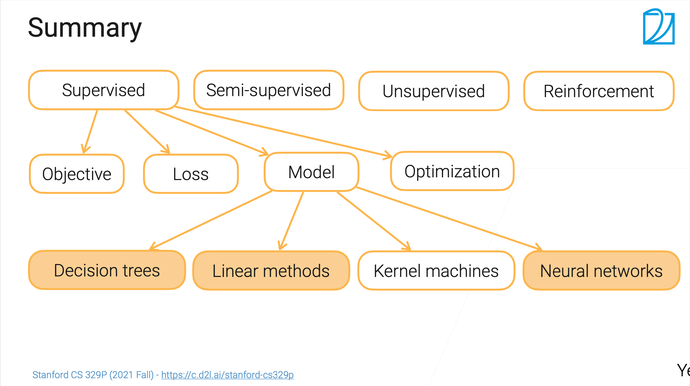

# 学习笔记--3.1 机器学习介绍
# SSS[课程链接](https://www.bilibili.com/video/BV1Nv411u7bW/?spm_id_from=333.788&vd_source=f20f12f3aeb414c35504dd8ea1cba544)

## ML 算法类型

ML算法分为4大类：

* 监督学习：再有标注的数据集上训练，预测标注（自监督学习，标号来自数据本身）
* 半监督学习：在有标注和无标注的数据集上训练，用训练好的模型去预测无标注数据的标注（如：自训练，**和自监督学习区分开**）
* 无监督学习：在无标注的数据集上训练，如：聚类算法，密度估计算法
* 强化学习：通过与环境的交互来学习如何采取行动，以最大化某种累积奖励。（主打一个进化）

## 监督学习构成

* 模型：预测输入数据，并输出结果
* 损失：预测值和真实值之间的差距，常见的如：均方误差(predict_price−sale_price)²
* 目标（损失）函数：用于**衡量**模型预测结果与实际结果之间的差异，并指导模型参数的调整以最小化这种差异。
* 优化算法：用于调整模型参数的算法，最小化（或最大化）损失函数的值。

## 监督学习模型分类

决策树、线性回归、内核机器、神经网络

## 总结

## 课后扩展

### 1. 无监督学习理解
无监督学习是一种机器学习方法，与监督学习不同，它不依赖于标注数据。换句话说，**在无监督学习中，数据集没有明确的输入-输出对，模型需要自己发现数据中的结构和模式。**

#### 无监督学习的简单理解

想象你有一堆未分类的照片，你不知道每张照片属于哪个类别。无监督学习就像是让计算机自己去发现这些照片之间的相似性和差异，把相似的照片归为一类。

#### 无监督学习的主要任务

1. **聚类（Clustering）**：
   - 目标是将数据分成不同的组，每组内部的数据相似度高，不同组之间的相似度低。
   - 例子：将客户分成不同的群体，以便进行有针对性的营销。
   - 常见算法：K均值（K-Means）、层次聚类（Hierarchical Clustering）、DBSCAN等。

2. **降维（Dimensionality Reduction）**：
   - 目标是将高维数据映射到低维空间，保留尽可能多的有用信息。
   - 例子：将高维图像数据压缩到二维或三维，以便可视化。
   - 常见算法：主成分分析（PCA）、t-SNE、UMAP等。

3. **关联规则学习（Association Rule Learning）**：
   - 目标是发现数据中不同特征之间的有趣关系。
   - 例子：在购物篮分析中发现哪些商品经常一起购买。
   - 常见算法：Apriori、Eclat等。

#### 无监督学习的应用

无监督学习在很多领域都有应用，包括但不限于：

- **客户细分**：根据客户行为数据，将客户分成不同的群体。
- **图像处理**：将图像数据进行降维，以便于分类或检索。
- **市场篮分析**：发现购物篮中商品之间的关联关系。
- **异常检测**：检测数据中的异常点，如信用卡欺诈检测。

#### 无监督学习的挑战

无监督学习的主要挑战在于：

1. **没有明确的目标**：由于没有标签，评估模型效果较为困难。
2. **结果解释性**：模型发现的模式和结构可能难以解释。
3. **算法选择**：不同算法适用于不同类型的数据，选择合适的算法需要经验。

#### 总结

无监督学习是一种不依赖于标注数据的学习方法，常见任务包括聚类、降维和关联规则学习。它在很多领域有广泛的应用，但也面临着没有明确目标和结果解释性差的挑战。

### 2.强化学习理解
强化学习（Reinforcement Learning, RL）是一种机器学习方法，通过与环境的交互来学习如何采取行动，以最大化某种累积奖励。它类似于训练宠物，通过奖励和惩罚来教它们做出正确的行为。

#### 强化学习的简单理解

想象你在玩一个游戏，刚开始你不知道规则，但你通过不断尝试和失败，逐渐学会了如何得高分。每次你做出正确的动作，游戏会给你奖励（比如得分），每次你做出错误的动作，游戏会给你惩罚（比如扣分）。通过这种方式，你逐渐学会了如何在游戏中表现得更好。

#### 强化学习的基本概念

1. **代理（Agent）**：学习和决策的主体，比如玩游戏的玩家。
2. **环境（Environment）**：代理所处的外部世界，比如游戏本身。
3. **状态（State）**：环境在某一时刻的具体情况，比如游戏的当前画面。
4. **动作（Action）**：代理在某一状态下可以采取的行为，比如在游戏中移动、跳跃等。
5. **奖励（Reward）**：代理在执行某一动作后从环境中获得的反馈，比如得分或扣分。
6. **策略（Policy）**：代理在每一个状态下选择动作的规则或函数。
7. **值函数（Value Function）**：评估某一状态或状态-动作对的长期回报。

#### 强化学习的核心思想

强化学习的核心思想是通过试错法（Trial and Error）来学习策略，以最大化累积奖励。代理在与环境的交互过程中，不断调整策略，以期在长期内获得最大的奖励。

#### 强化学习的主要算法

1. **Q学习（Q-Learning）**：
   - 通过更新状态-动作对的值函数（Q值）来学习最优策略。
   - Q值表示在某一状态下采取某一动作的预期累积奖励。

2. **深度Q网络（DQN）**：
   - 结合深度学习和Q学习，使用神经网络来逼近Q值函数。
   - 适用于高维状态空间，如图像数据。

3. **策略梯度（Policy Gradient）**：
   - 直接优化策略函数，通过梯度上升法来最大化预期累积奖励。
   - 适用于连续动作空间。

4. **演员-评论家（Actor-Critic）**：
   - 结合值函数和策略函数，使用“演员”更新策略，“评论家”评估策略。
   - 兼具Q学习和策略梯度的优点。

#### 强化学习的应用

强化学习在许多领域有广泛的应用，包括但不限于：

- **游戏AI**：训练智能体在复杂游戏中表现出色，如AlphaGo。
- **机器人控制**：让机器人通过学习来完成复杂任务，如行走、抓取物体等。
- **自动驾驶**：通过模拟环境训练自动驾驶算法，提高驾驶安全性和效率。
- **金融交易**：通过学习市场模式来制定交易策略，最大化收益。

#### 总结

强化学习是一种通过与环境交互来学习最优策略的方法，旨在最大化累积奖励。它通过试错法不断调整策略，主要算法包括Q学习、DQN、策略梯度和演员-评论家。强化学习在游戏AI、机器人控制、自动驾驶和金融交易等领域有广泛应用。

### 3.过拟合理解
过拟合是机器学习中的一个常见问题，指的是模型在训练数据上表现得非常好，但在新数据（测试数据）上表现得很差。简单来说，模型“记住”了训练数据中的细节和噪音，而不是学到了数据的普遍规律。

#### 过拟合的简单理解

想象你在准备考试时，只是死记硬背了所有的练习题答案。这意味着你在练习题上得分很高，但如果考试题目稍有不同，你可能就不会做了。这就是过拟合的概念。

#### 过拟合的原因

1. **模型太复杂**：模型有太多的参数或层次，能够拟合训练数据中的每一个细节和噪音。
2. **训练数据不足**：数据量太少，模型容易“记住”数据而不是学到规律。
3. **数据噪音**：训练数据中包含很多随机的噪音或异常值，模型也把这些噪音当作模式学习了。

#### 如何检测过拟合

1. **训练误差 vs. 测试误差**：
   - 如果模型在训练数据上的误差很小，但在测试数据上的误差很大，通常就是过拟合的迹象。

#### 如何防止过拟合

1. **增加数据量**：更多的数据可以帮助模型学到更普遍的规律。
2. **简化模型**：减少模型的参数或层次，使其不能过于复杂。
3. **正则化**：在损失函数中加入惩罚项，限制模型参数的大小，常见的方法有L1和L2正则化。
4. **交叉验证**：将数据分成多份，交替使用不同的部分进行训练和验证，以确保模型的泛化能力。
5. **早停法**：在训练过程中监控模型在验证集上的表现，当验证误差开始上升时，停止训练。

#### 总结

过拟合是指模型在训练数据上表现很好，但在新数据上表现很差的现象。为了避免过拟合，可以增加数据量、简化模型、使用正则化、进行交叉验证和采用早停法等方法。

### 4.什么是回归？

回归是一种预测数值的技术。比如，你想根据房子的面积来预测房子的价格，这就是一个回归问题。

#### 回归的基本概念

1. **输入（自变量/特征）**：你用来预测的东西，比如房子的面积、房间数量等。
2. **输出（因变量/目标变量）**：你想预测的结果，比如房子的价格。

#### 常见的回归类型

1. **线性回归**：
   - 假设输入和输出之间的关系是线性的，即一条直线。公式很简单：价格 = 截距 + 面积 * 斜率。

2. **多项式回归**：
   - 如果直线不够好用，可以用曲线来描述输入和输出之间的关系。比如，价格 = 截距 + 面积 * 斜率 + 面积² * 斜率²。

#### 回归的应用

回归可以用在很多地方，比如：

- **预测房价**：根据房子的面积、位置等特征来预测价格。
- **预测销售量**：根据广告投入、市场情况等来预测产品的销售量。
- **预测天气**：根据历史天气数据来预测未来的温度。

#### 如何评估回归模型

我们可以用一些指标来评估回归模型的好坏，比如：

- **均方误差（MSE）**：预测值和实际值之间的平均差距，越小越好。

#### 总结

回归就是用来预测数值的一种方法，根据输入的特征来预测目标值。线性回归是最简单的一种，假设输入和输出之间是直线关系。如果直线不够好用，可以用曲线（多项式回归）来描述。