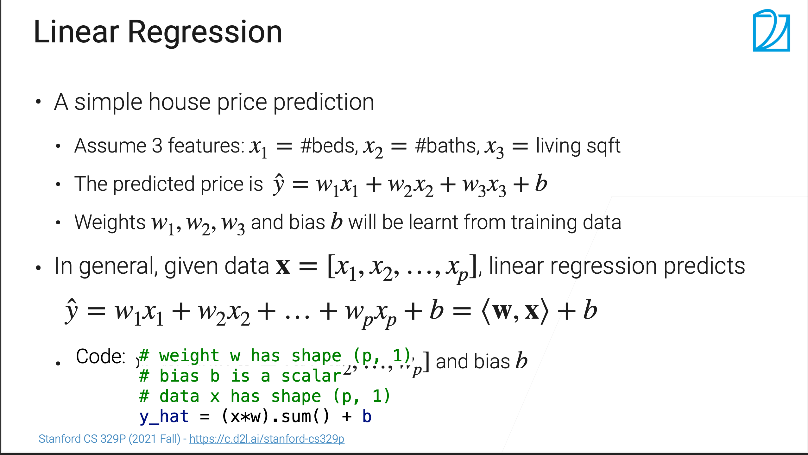
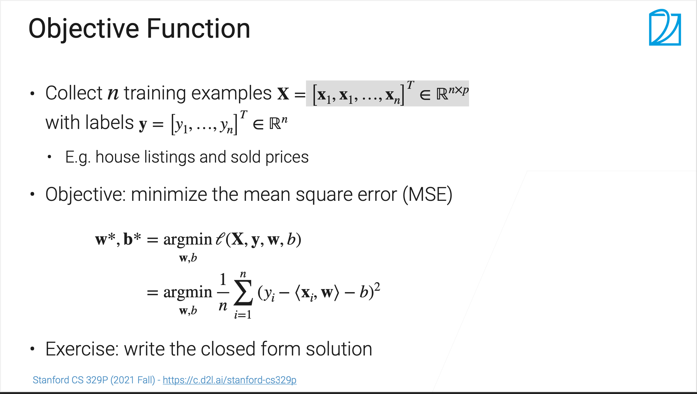
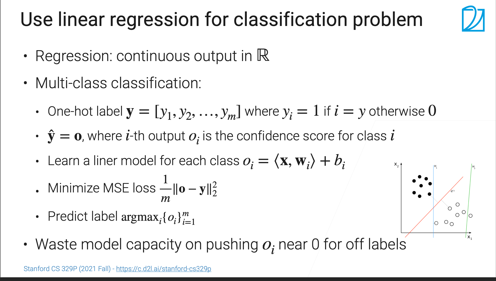

# 学习笔记--3.3 线性模型
# SSS[课程链接](https://www.bilibili.com/video/BV1eh411b7ZW/?spm_id_from=333.788&vd_source=f20f12f3aeb414c35504dd8ea1cba544)

## 线性回归

* 一个简单的房价预测case
  * 假设有三个特征：x1 = 卧室个数；x2 = 卫生间个数； x3 = 居住面积
  * 预测的价格： y = w1 * x1 + w2 * x2 + w3 * x3 + b
  * 权重w1/w2/w3和偏移b都是可以学习调整的参数
* 通常，我们样本是一个p维的特征的数据，用向量表达就是 X = [x1, x2, x3, ... , xp]，回归的方程式表达为
  * y = w1 * x1 + w2 * x2 + w3 * x3 + ... + wp * xp + b = <w,x> + b
  * 权重 W = [w1, w2, w3, w4, ... , wp] 和 b都可以训练
* 代码表示
```commandline
# weight w has shape (p, 1)
# bias b is a scalar
# data x has shape (p, 1)
y_hat = (x*w).sum() + b
```
* 简单理解类比数学中的（x,y）线性函数+向量的概念，有多少特征，就是多少维的向量，预测值是多维空间的线性分布

### 目标函数

* 收集 n 个样本，记为 X =  [x1, x1, ..., xn]T ∈ Rn×p，对应的标号（预测值）记为 Y = [y1, ..., yn]T ∈ Rn
  * X 为长度为n的向量
  * Y 为长度为n的向量
  * 每个x有p个特征
    * 组成 n * p 的矩阵
* 目标：最小化均方误差（MSE）

## 线性模型做分类

* 回归：输出是连续的实数
* 多类型分类问题：
  * 向量类型输出：输出向量中第i的元素，反映的是属于第i类的置信度是多少