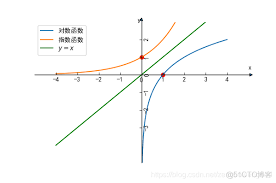
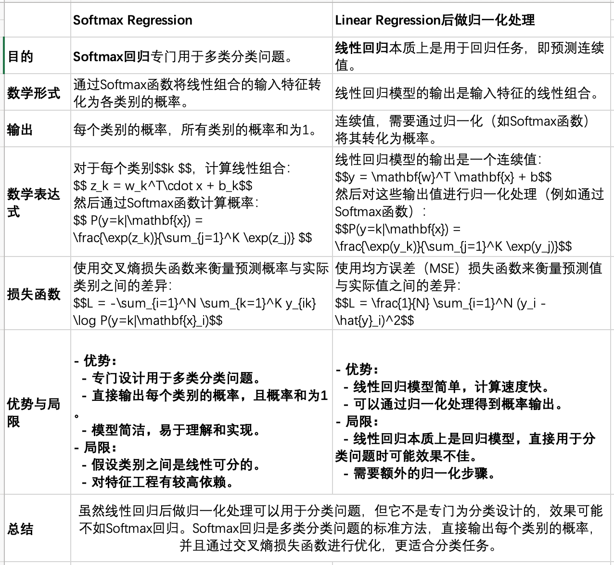

原理是挺费劲的，尤其是数学公式，但代码很好理解，文档中代码可以直接跑，有手就会
# 前言（前置知识点简单科普）
线性模型属于ML中监督学习的一个分支算法，主要应用于回归和分类问题。
ML大致分为以下四种类型：
- 监督学习：再有标注的数据集上训练，预测标注（自监督学习，标号来自数据本身）
- 半监督学习：在有标注和无标注的数据集上训练，用训练好的模型去预测无标注数据的标注（如：自训练）
- 无监督学习：在无标注的数据集上训练，如：聚类算法，密度估计算法
- 强化学习：通过与环境的交互来学习如何采取行动，以最大化某种累积奖励。（主打一个学习进化）


监督学习构成有：模型、损失、目标（损失）函数以及优化算法
- 模型：预测输入数据，并输出结果
- 损失：预测值和真实值之间的差距，常见的如：均方误差(predict_price−sale_price)²
- 目标（损失）函数：用于**衡量**模型预测结果与实际结果之间的差异，并指导模型参数的调整以最小化这种差异。
- 优化算法：用于调整模型参数的算法，最小化（或最大化）损失函数的值。

# Linear Regression
线性回归是一种统计方法，用于建立因变量（目标变量）和一个或多个自变量（特征变量）之间的线性关系。它是最简单、最基本的回归分析方法之一。

## 数学原理

### 线性回归的基本原理
线性回归的目标是找到一条直线，使得它能够尽可能准确地预测因变量的值。对于简单线性回归（只有一个自变量），模型的形式是：
\[ y = \beta_0 + \beta_1 x + \epsilon \]
其中：
- **\( y \)** 是因变量。
- **\( x \)** 是自变量。
- **\( \beta_0 \)** 是截距，即当$$x = 0$$时$$y$$的预测值。
- **\( \beta_1 \)** 是斜率，即$$x$$ 每增加一个单位，$$y$$的变化量。
- **\( \epsilon \)** 是误差项，表示模型预测与实际值之间的差异。

### 多元线性回归
如果有多个自变量，模型可以扩展为多元线性回归：

\[ y = \beta_0 + \beta_1 x_1 + \beta_2 x_2 + \cdots + \beta_n x_n + \epsilon \]

## 训练过程
### 损失函数

线性回归使用均方误差（MSE）作为损失函数，MSE 是误差平方和的平均值，用于衡量模型预测的准确性。
\[ \text{MSE} = \frac{1}{n} \sum_{i=1}^{n} (y_i - \hat{y}_i)^2 \]

### 参数优化
线性回归的参数优化主要是指找到最佳的回归系数（即截距和斜率），使得模型的预测误差最小。最常用的方法是最小二乘法（Ordinary Least Squares, OLS），但在某些情况下，也可以使用其他优化方法，如梯度下降法，正则化（Ridge和Lasso回归）等。（TODO 还没学完后面补充 ）

## 实战：【简单回归问题】经典：房价预测（TODO 简单，后面补）

## 实战：【简单分类问题】【0/1分类】使用线性回归模型来预测学生是否通过考试
假设我们有一个简单的二分类问题，目标是根据学生的学习时间预测其是否通过考试（通过记为1，未通过记为0）。
### 数据集
| 学习时间（小时） | 是否通过考试（0或1） |
|------------------|-----------------------|
| 1                | 0                     |
| 2                | 0                     |
| 3                | 0                     |
| 4                | 1                     |
| 5                | 1                     |
### 步骤

#### 1. 数据准备
首先，我们将数据分为自变量（学习时间）和因变量（是否通过考试）。
```
# 处理表的工具包
import pandas as pd

# 创建数据集；创建了一个字典 data，包含两个键：学习时间 和 是否通过考试，分别对应自变量和因变量的数据。
data = {'学习时间': [1, 2, 3, 4, 5],
        '是否通过考试': [0, 0, 0, 1, 1]}
# 使用 pandas 的 DataFrame 将字典转换为一个数据框 df。
df = pd.DataFrame(data)
```
#### 2. 拟合线性回归模型
使用线性回归模型来拟合数据。
```
# 来自 scikit-learn 的线性回归模型，用于进行回归分析。
from sklearn.linear_model import LinearRegression

# 自变量和因变量
# X 是自变量（特征），即 学习时间 列。
X = df[['学习时间']]
# y 是因变量（目标），即 是否通过考试 列。
y = df['是否通过考试']

# 创建线性回归模型
model = LinearRegression()
# 使用fit方法去拟合模型，X 是自变量，y 是因变量。
model.fit(X, y)

# 打印模型参数、
# model.intercept_：模型的截距（偏置项）
print(f'截距: {model.intercept_}')
# model.coef_：模型的系数（权重），对应自变量 学习时间
print(f'系数: {model.coef_}')
# 函数表达为 y = model.coef_ * X + model.intercept_
```
#### 3. 预测
使用拟合好的模型进行预测。
```
# 预测
predictions = model.predict(X)
print(predictions)
预测值为：
$$[-0.2, 0.1, 0.4, 0.7,1.0] $$
```
#### 4. 应用阈值
选择阈值0.5，将预测值映射到类别标签。
```
# 应用阈值
# 定义一个阈值 threshold 为 0.5
threshold = 0.5
# 使用列表推导式，根据预测值 predictions 和阈值 threshold 生成分类结果 predicted_classes：
# 如果预测值大于阈值，则分类为 1（通过考试）。
# 否则分类为 0（未通过考试）。
predicted_classes = [1 if pred > threshold else 0 for pred in predictions]
print(predicted_classes)
得到的类别预测为：
$$[0, 0, 0, 1, 1]$$
```
### 结果分析
通过以上步骤，我们使用线性回归模型对学生是否通过考试进行了预测，并应用了阈值将连续预测值转换为类别标签。结果表明，模型能够正确分类大部分样本，但由于线性回归的输出是连续值，可能会出现一些不合理的预测值（如负值），这在分类问题中是不合适的。

### 线性回归用于分类的局限性
1. 输出范围不合适：线性回归的输出可以是任何实数，而分类问题通常需要一个有限的类别集合。
2. 误差度量不匹配：分类问题通常使用分类精度、混淆矩阵、AUC-ROC等指标来评估模型，而线性回归使用均方误差（MSE）或均方根误差（RMSE）等指标，这些指标不适合分类问题。
3. 模型假设不匹配：线性回归假设自变量和因变量之间存在线性关系，而分类问题的类别标签可能与自变量之间的关系更加复杂。

## 实战：【多类分类问题】预测花的种类
假设我们有一个数据集，包含花的特征（如花瓣长度、花瓣宽度等）和花的种类（例如，三种不同的花：Setosa、Versicolor和Virginica）。我们的目标是根据花的特征预测属于每一类的概率。

### 数据集

| 花瓣长度 | 花瓣宽度 | 花的种类      |
|----------|----------|---------------|
| 1.4      | 0.2      | Setosa        |
| 1.3      | 0.2      | Setosa        |
| 4.7      | 1.4      | Versicolor    |
| 4.5      | 1.5      | Versicolor    |
| 5.1      | 1.8      | Virginica     |
| 5.9      | 2.1      | Virginica     |

### 步骤
#### 1. 数据准备
首先，我们将数据分为自变量（花瓣长度和花瓣宽度）和因变量（花的种类）。
```
# python里面做数据分析最常见的包
import numpy as np
# 处理表的工具包
import pandas as pd

# 创建数据集：创建一个字典data，包含三个键'花瓣长度'，'花瓣宽度'，'花的种类'，，分别对应自变量和因变量的数据。
data = {'花瓣长度': [1.4, 1.3, 4.7, 4.5, 5.1, 5.9],
        '花瓣宽度': [0.2, 0.2, 1.4, 1.5, 1.8, 2.1],
        '花的种类': ['Setosa', 'Setosa', 'Versicolor', 'Versicolor', 'Virginica', 'Virginica']}
# 使用 pandas 的 DataFrame 将字典转换为一个数据框 df。
df = pd.DataFrame(data)
```

#### 2. 编码因变量
将花的种类编码为数值类型（例如，Setosa编码为0，Versicolor编码为1，Virginica编码为2）。
```
# 来自 scikit-learn 的标签解码，用于把类别转化为数值类型
from sklearn.preprocessing import LabelEncoder

# 编码因变量
label_encoder = LabelEncoder()
# 将花的种类编码为数值类型（例如，Setosa编码为0，Versicolor编码为1，Virginica编码为2）。
df['花的种类编码'] = label_encoder.fit_transform(df['花的种类'])
```

#### 3. 创建虚拟变量（One-Hot Encoding）
将因变量转换为虚拟变量（One-Hot Encoding），以便我们可以拟合多个线性回归模型，每个模型对应一个类别。
```
from sklearn.preprocessing import OneHotEncoder

# 创建One-Hot编码
# One-Hot编码：编码是一种将类别变量转换为数值表示的方法
# One-Hot 编码的步骤：
#   类别识别：识别所有可能的类别。
#   向量化：为每个类别分配一个唯一的二进制向量。
# 原始数据
# |花的种类|
# |Setosa|
# |Versicolor|
# |Virginica|
# |Setosa|
# One-Hot 编码后
# |Setosa   |Versicolor    |Virginica
# |1        |0         |0
# |0        |1         |0
# |0        |0         |1
# |1        |0         |0
onehot_encoder = OneHotEncoder(sparse_output=False)
y_onehot = onehot_encoder.fit_transform(df[['花的种类编码']])
print(f'y_onehot ： \n{y_onehot}')
```

#### 4. 拟合线性回归模型
为每个类别拟合一个线性回归模型。
```
from sklearn.linear_model import LinearRegression

# 自变量
X = df[['花瓣长度', '花瓣宽度']]

# 创建线性回归模型列表,为每一个类型（列）创建线性回归模型
models = []
for i in range(y_onehot.shape[1]):
    model = LinearRegression()
    print(f'y_onehot{i} ： \n{y_onehot[:, i]}')
    # 这个拟合有点东西，之前的case中（如twoclass.py）fit拟合的目标值是一个具体的数值，
    # 本case中y_onehot[:, i]的值是一个向量，这里其实有一层转化关系，y_onehot每一列
    # 代表一个类别。
    # Setosa、Versicolor 和 Virginica One-Hot 编码之后的表达为：
    #   Setosa     -> [1, 0, 0]
    #   Versicolor -> [0, 1, 0]
    #   Virginica  -> [0, 0, 1]
    # y_onehot的输出为：
    #   [[1. 0. 0.]
    #   [1. 0. 0.]
    #   [0. 1. 0.]
    #   [0. 1. 0.]
    #   [0. 0. 1.]
    #   [0. 0. 1.]]
    # 映射关系为：
    # PetalLength | PetalWidth | Species
    # ------------|------------|---------
    # 1.4         | 0.2        | Setosa
    # 1.3         | 0.2        | Setosa
    # 4.5         | 1.5        | Versicolor
    # 4.9         | 1.5        | Versicolor
    # 6.1         | 2.3        | Virginica
    # 5.9         | 2.1        | Virginica
    # -----------------------------------------
    # PetalLength | PetalWidth | Setosa | Versicolor | Virginica
    # ------------|------------|--------|------------|----------
    # 1.4         | 0.2        | 1      | 0          | 0
    # 1.3         | 0.2        | 1      | 0          | 0
    # 4.5         | 1.5        | 0      | 1          | 0
    # 4.9         | 1.5        | 0      | 1          | 0
    # 6.1         | 2.3        | 0      | 0          | 1
    # 5.9         | 2.1        | 0      | 0          | 1
    # 每一列代表一个类别，如Setosa这一列，表示的是是否属于Setosa类，他值只有0/1两种，1属于Setosa，0则不属于
    model.fit(X, y_onehot[:, i])
    models.append(model)
    
print('model in models')
for index,model in enumerate(models):
    # 打印模型参数
    print(f'index: {index}')
    print(f'截距: {model.intercept_}')
    print(f'系数: {model.coef_}') 
```

#### 5. 预测概率
使用拟合好的模型进行预测，并将输出转换为概率。

```
# 预测：对每个模型进行预测，得到预测值 predictions
# 进行预测并打印每个模型的预测结果
predictions_list = []
for index, model in enumerate(models):
    # 这里神奇的是predict的结果也是一个向量（列），每一个样本都会在该模型上预测一次。对应的表为
    # PetalLength | PetalWidth | Setosa   | Versicolor | Virginica
    # ------------|------------|----------|------------|----------
    # 1.4         | 0.2        | 0.941780 | 0.173932   | 0.000000
    # 1.3         | 0.2        | 0.994265 | 0.000437   | 0.005297
    # 4.5         | 1.5        | 0.001701 | 1.000000   | 0.000000
    # 4.9         | 1.5        | 0.172669 | 0.308864   | 0.518467
    # 6.1         | 2.3        | 0.055742 | 0.139816   | 0.804442
    # 5.9         | 2.1        | 0.000000 | 0.317758   | 0.848399
    prediction = model.predict(X)
    predictions_list.append(prediction)
    print(f"Model {index} predictions: {prediction}")
# 将预测结果转置
predictions = np.array(predictions_list).T

# 将输出转换为概率：使用 np.clip 将预测值限制在 0 到 1 之间。
probabilities = np.clip(predictions, 0, 1)
print(probabilities)

# 将预测值归一化为概率，使每行的和为 1。
probabilities /= probabilities.sum(axis=1, keepdims=True)
print(probabilities)
```
#### 示例输出

| 样本索引 | Setosa概率 | Versicolor概率 | Virginica概率 |
|----------|------------|----------------|---------------|
| 0        | 0.867      | 0.124          | 0.009         |
| 1        | 0.879      | 0.113          | 0.008         |
| 2        | 0.089      | 0.506          | 0.405         |
| 3        | 0.107      | 0.511          | 0.382         |
| 4        | 0.045      | 0.433          | 0.521         |
| 5        | 0.013      | 0.312          | 0.675         |

这些概率表示每个样本属于每个类别的可能性。

### 总结
可以看到很费劲，有多少个类别我就得创建多少个模型，针对每个类别单独学习成本较高。好在我们还有Softmax回归（Softmax Regression），专门设计用于多类分类问题，直接输出每个类别的概率，且概率和为1，模型简洁，易于理解和实现。

# Softmax Regression
Softmax回归（Softmax Regression），也称为多类逻辑回归（Multinomial Logistic Regression），是一种广泛用于多类分类问题的统计模型。它的主要目的是根据输入特征预测样本属于不同类别的概率，它通过一个Softmax函数将线性组合的输入特征转化为各类别的概率。Softmax函数的输出是一个概率分布，所有类别的概率和为1。

## 数学原理
### 假设
假设我们有一个输入特征向量x和K个类别，Softmax回归的目标是计算每个类别k的概率。
\[ P(y=k|x) \]

恶补数学知识emo
- P：概率（Probability）。这是一个概率值，表示某个事件发生的可能性。
- y：目标变量或因变量（Target Variable）。在分类问题中， 通常表示类别标签。
- k：特定类别（Specific Class）。 是一个具体的类别标签值。例如，如果我们有三种类别（A、B、C），那么  可以是A、B或C中的一个。
- x：输入特征向量（Input Feature Vector）。 是一个包含多个特征值的向量，用于描述样本的特征。例如，如果我们有两个特征（花瓣长度和花瓣宽度），那么  可以表示为 。
-  P(y=k|x)：条件概率（Conditional Probability）。表示在给定输入特征向量x 的情况下，样本属于类别k的概率。

### 线性组合
对于每个类别 ，计算线性组合：
\[ z_k = w_k^T\cdot x + b_k \]

恶补数学知识emo
- \[ z_k\]：线性组合结果（Linear Combination Result）。这是类别k的线性组合结果，用于后续的Softmax函数计算。可以理解为输入特征经过加权和偏置调整后的得分。
- \[w_k\]：类别k的权重向量（Weight Vector for Class ）。这是一个向量，包含了每个输入特征对应的权重。权重向量的维度与输入特征向量x的维度相同。
- \[w_k^T\]：权重向量的转置（Transpose of Weight Vector）。在这里，转置操作将列向量转换为行向量，以便进行点积运算。
  - 如：[[1],[2],[3]]转化为[1,2,3]
- \[x\]：输入特征向量（Input Feature Vector）。这是一个包含多个特征值的向量，用于描述样本的特征。向量的维度取决于特征的数量。
- \[b_k\]：类别k的偏移（Bias for Class ）。这是一个常数项，用于调整线性组合结果，类似于线性回归中的截距。
- 点积（内积）：两个向量相乘，结果是一个标量，常用于计算夹角、投影等。
- 叉积（外积）：两个三维向量相乘，结果是一个新的向量，常用于计算力矩、磁场等。
- 标量：是一个具有大小但没有方向的量（单一数值）。
解释：对于每个类别 \[k\] ，我们将输入特征向量 \[x\]与类别\[k\] 的权重向量\[w_k\]进行点积（内积），再加上一个偏置项\[b_k\] ，得到线性组合结果\[z_k\] 。

### Softmax函数
将线性组合的结果通过Softmax函数转化为概率：
\[ P(y=k|\mathbf{x}) = \frac{\exp(z_k)}{\sum_{j=1}^K \exp(z_j)} \]

恶补数学知识emo
- \[ P(y=k|\mathbf{x})$$：样本属于类别\[k\]的概率。上面有介绍这里不做重复解释
- \[exp(z_k)\]：这是类别\[k\] 的得分\[z_k\] 的指数函数。指数函数\[exp()\]将得分转换为正值，确保概率值为正，（底数为\[e\]，\[e \approx 2.718281828459045\]）。
- \[{\sum_{j=1}^K \exp(z_j)}\]:这是所有类别得分的指数函数的总和。\[K\]是总类别数，\[\sum_{}\]表示求和操作，从第1类到第\[K\]类，\[z_j\]是类别\[j\]的得分

#### 补：指数函数
\[y = a ^ x\]



解释：Softmax函数将每个类别的线性组合结果\[z_k\] 转化为概率。具体做法是先计算每个\[z_k\] 的指数函数值，然后将其除以所有类别的指数函数值之和。这样得到的每个类别的概率\[ P(y=k|\mathbf{x})\]之和为1。

## 训练过程
### 损失函数
Softmax回归使用交叉熵损失函数来衡量预测概率与实际类别之间的差异：
\[ L = -\sum_{i=1}^N \sum_{k=1}^K y_{ik} \log P(y=k|\mathbf{x}_i) \]

恶补数学知识emo
- \[L\]：损失函数的值，表示模型在整个训练数据集上的总损失。损失函数的目的是衡量模型预测与实际标签之间的差异，损失越小，模型性能越好。
- 负号 (-)：由于对数函数的值为负数，为了得到正的损失值，前面加上一个负号。
- 外层求和\[ \sum_{i=1}^N\]：对所有训练样本进行求和，\[N\]是样本数，\[i\]是第\[i\]个类别的索引。
- 内层求和\[ \sum_{k=1}^K\]：\[K\]类别的总数，\[k\]是第\[k\]个类别的索引。对每个样本\[i\]的所有类别\[k\]进行求和，计算该样本在所有类别上的损失。对于每个类别\[k\]，如果样本\[i\]属于该类别（即\[y_{ik} = 1\]），则计算该类别的预测概率的对数损失；如果不属于（即\[y_{ik} = 0\]），则该项对损失没有贡献。
- \[ y_{ik} \]：第\[i\]个训练样本在第\[k\]个类别上的实际标签。\[ y_{ik} \]通常是一个二进制值（0或1），其中1表示第\[i\]个样本属于第\[k\]类，0表示不属于。
- \[ \log \]：对数函数，通常使用自然对数（底数为\[e\]，\[e \approx 2.718281828459045\]）对数函数用于将概率转换为对数空间，便于计算和优化。
- \[ P(y=k|\mathbf{x}_i) \]：这是给定输入特征向量\[ \mathbf{x}_i \]时，模型预测输出类别\[y\] 为 \[k\]的条件概率，这个概率通常是通过Softmax函数计算得到的。

#### 示例
假设我们有一个包含3个样本的训练集，每个样本可以属于3个类别之一。对于每个样本，我们有实际标签 \[y\]和模型预测的概率\[P\]：
```
样本 1: 实际标签 y = [1, 0, 0], 预测概率 P = [0.7, 0.2, 0.1]
样本 2: 实际标签 y = [0, 1, 0], 预测概率 P = [0.1, 0.6, 0.3]
样本 3: 实际标签 y = [0, 0, 1], 预测概率 P = [0.2, 0.2, 0.6]
```
交叉熵损失函数的计算如下：
\[ L = - \left( 1 \cdot \log(0.7) + 0 \cdot \log(0.2) + 0 \cdot \log(0.1) \right) 
- \left( 0 \cdot \log(0.1) + 1 \cdot \log(0.6) + 0 \cdot \log(0.3) \right) - \left( 0 \cdot \log(0.2) + 0 \cdot \log(0.2) + 1 \cdot \log(0.6) \right) \]

#### 补：对数函数
\[y = \log_βx\]
\[x = β^y\]


#### 补：为什么要用log作为损失函数 
|  |                                                                                                                                                                                                                      |
|--|----------------------------------------------------------------------------------------------------------------------------------------------------------------------------------------------------------------------|
| - 确保损失函数是凸的，便于优化。 | - 对数函数的凸性：对数函数是一个凸函数，这意味着它的曲线是向上的，只有一个全局最小值。使用凸函数作为损失函数可以确保优化问题是凸的，从而使得梯度下降等优化算法能够更有效地找到全局最优解，而不是陷入局部最优。                                                                                                             |
| - 强调小概率事件的损失，促使模型更加关注错误分类的样本。 | - 交叉熵损失函数的性质：交叉熵损失函数（Cross-Entropy Loss）使用对数函数来度量预测概率分布与实际标签分布之间的差异。对数函数在这里的作用是将概率值转换为对数空间，从而使得小概率事件的损失更大，大概率事件的损失更小。这种特性有助于模型更加关注那些被错误分类的样本。                                                                        |
| - 简化梯度计算，加速优化过程。 | - 对数函数的梯度性质使得优化过程更加简单和高效。具体来说，对数函数的导数（表示函数在某一点处的瞬时变化率或斜率。）有如下形式：\[ \frac{d}{dx} \log(x) = \frac{1}{x}\]。在Softmax回归中，损失函数对模型参数的梯度计算涉及到对数函数的导数，这使得梯度的计算更加方便，从而加速了梯度下降等优化算法的收敛速度。                                       |
| - 避免数值下溢问题。 | - 解释概率的乘积：在分类问题中，我们通常希望最大化模型预测的概率。对于多个独立事件的联合概率，我们通过将这些概率相乘来得到联合概率。但由于直接相乘可能导致数值下溢（即非常小的数相乘导致结果趋近于零），我们通常使用对数将乘法转换为加法：$$\log(P_1 \times P_2 \times \ldots \times P_N) = \log(P_1) + \log(P_2) + \ldots + \log(P_N)$$ |
| - 提供信息论上的解释，量化预测分布与实际分布之间的差异。 | - 信息论的解释：交叉熵源自信息论，用于衡量两个概率分布之间的差异。具体来说，交叉熵衡量的是实际分布（真实标签）与预测分布（模型输出）之间的差异。对数函数在这里的作用是将这种差异量化为一个可优化的目标。                                                                                                                |

### 参数优化
通过梯度下降或其他优化算法最小化损失函数，更新权重\[\mathbf{w}_k\]和偏置\[b_k\]。
- 梯度下降：一种常见的优化算法，通过计算损失函数对模型参数的梯度，逐步调整参数以最小化损失函数。
- 权重\[\mathbf{w}_k\]：每个类别的权重向量，需要通过优化算法进行更新。
- 偏置\[b_k\]：每个类别的偏置，需要通过优化算法进行更新。

解释：在训练过程中，我们通过优化算法（如梯度下降）不断调整模型参数（权重和偏置），以最小化损失函数值，从而提高模型的预测准确性。

## 实战：【多类分类问题】预测花的种类
假设我们有一个数据集，包含花的特征（如花瓣长度、花瓣宽度等）和花的种类（例如，三种不同的花：Setosa、Versicolor和Virginica）。我们的目标是根据花的特征预测花的种类。

### 数据集
| 花瓣长度 | 花瓣宽度 | 花的种类      |
|----------|----------|---------------|
| 1.4      | 0.2      | Setosa        |
| 1.3      | 0.2      | Setosa        |
| 4.7      | 1.4      | Versicolor    |
| 4.5      | 1.5      | Versicolor    |
| 5.1      | 1.8      | Virginica     |
| 5.9      | 2.1      | Virginica     |

### 步骤

#### 1. 数据准备
首先，我们将数据分为自变量（花瓣长度和花瓣宽度）和因变量（花的种类）。
```
# python里面做数据分析最常见的包
import numpy as np
# 处理表的工具包
import pandas as pd

# 创建数据集：创建一个字典data，包含三个键'花瓣长度'，'花瓣宽度'，'花的种类'，，分别对应自变量和因变量的数据。
data = {'花瓣长度': [1.4, 1.3, 4.7, 4.5, 5.1, 5.9],
        '花瓣宽度': [0.2, 0.2, 1.4, 1.5, 1.8, 2.1],
        '花的种类': ['Setosa', 'Setosa', 'Versicolor', 'Versicolor', 'Virginica', 'Virginica']}
# 使用 pandas 的 DataFrame 将字典转换为一个数据框 df。
df = pd.DataFrame(data)
```

#### 2. 编码因变量
将花的种类编码为数值类型（例如，Setosa编码为0，Versicolor编码为1，Virginica编码为2）。

```
# 来自 scikit-learn 的标签解码，用于把类别转化为数值类型
from sklearn.preprocessing import LabelEncoder

# 编码因变量
label_encoder = LabelEncoder()
# 将花的种类编码为数值类型（例如，Setosa编码为0，Versicolor编码为1，Virginica编码为2）。
df['花的种类编码'] = label_encoder.fit_transform(df['花的种类'])
```

#### 3. 拟合Softmax回归模型
使用Softmax回归模型来拟合数据。

```
# LogisticRegression 用于创建逻辑回归模型。
from sklearn.linear_model import LogisticRegression

# 自变量和因变量
# X 是自变量（特征）
X = df[['花瓣长度', '花瓣宽度']]
# y 是因变量（目标）
y = df['花的种类编码']

# 创建Softmax回归模型
# 创建一个 LogisticRegression 实例 model，并指定 multi_class='multinomial' 以使用 Softmax 回归，solver='lbfgs' 作为优化算法。
model = LogisticRegression(multi_class='multinomial', solver='lbfgs')
# 使用fit方法去拟合（训练）模型，X 是自变量，y 是因变量。
model.fit(X, y)
```

#### 4. 预测概率
  使用拟合好的模型进行预测，并输出每个类别的概率。

```
# 预测并打印概率
probabilities = model.predict_proba(X)
print(probabilities)
```

### 结果分析
通过以上步骤，我们使用Softmax回归模型对花的种类进行了预测，并输出了每个类别的概率。结果表明，模型能够给出每个样本属于每个类别的概率。
### 示例输出
本地Demo预测概率：

| 样本索引 | 花瓣长度 | 花瓣宽度 | 花的种类       | 花的种类编码 | Setosa概率 | Versicolor概率 | Virginica概率 |
|------|------|------|------------|--------|----------|--------------|-------------|
| 0    | 1.4  | 0.2  | Setosa     | 0      | 0.867155 | 0.123939     | 0.008906    |
| 1    | 1.3  | 0.2  | Setosa     | 0      | 0.878792 | 0.113498     | 0.00771     |
| 2    | 4.7  | 1.4  | Versicolor | 1      | 0.088804 | 0.5064       | 0.404796    | 
| 3    | 4.5  | 1.5  | Versicolor | 1      | 0.106683 | 0.511127     | 0.382189    |
| 4    | 5.1  | 1.8  | Virginica  | 2      | 0.04521  | 0.433398     | 0.521392    |
| 5    | 5.9  | 2.1  | Virginica  | 2      | 0.013267 | 0.311633     | 0.6751      |

## 多类型分类问题：线性回归 vs Softmax回归
Softmax回归和线性回归后做归一化处理在本质上是不同的，尽管它们都可以用于分类任务。下面我们来详细比较一下这两种方法的区别。


